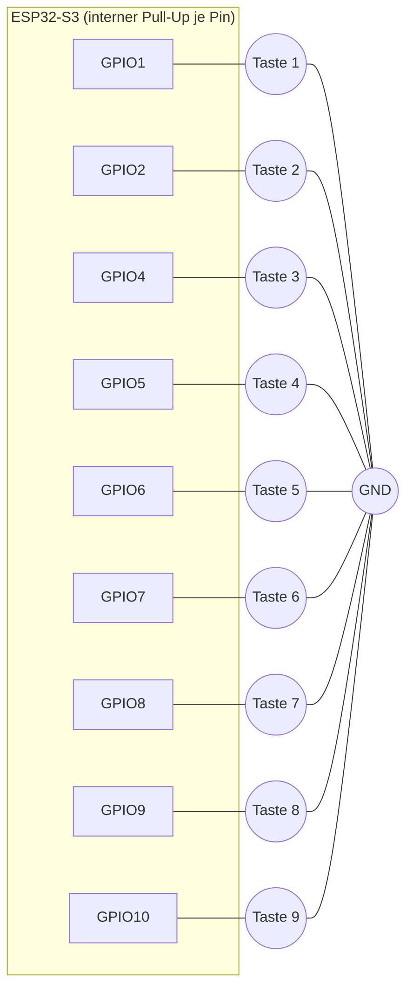

# StreamDeck4U
Ein Streamdeck auf Basis eines ESP32-S3, das seine Tasten über eine txt-Datein auf einer FAT Partition konfigurieren lässt.

## Überblick

StreamDeck4SW ist eine ESP32-S3-Firmware, die das Board als USB-HID-Tastatur am Host anmeldet. Neun digitale Eingänge (Taster gegen GND) werden auf Tastencodes gemappt und bei Betätigung als HID-Report gesendet - im Prinzip ein selbstgebautes Makro-Pad / Mini-Stream-Deck.

Das Gerät ist ein USB-Composite-Device aus zwei Interfaces:

- **HID-Keyboard-Interface** - sendet die Tastencodes an den Host
- **MSC-Interface (Mass Storage)** - stellt eine kleine FAT-Partition als USB-Laufwerk bereit, auf der die Konfigurationsdatei `keymap.txt` liegt. Die Tasten-zu-GPIO-Zuordnung lässt sich damit direkt am PC per Texteditor ändern, ganz ohne Neuflashen.

> ℹ️ **Hardware:** ESP32-S3, natives USB (kein separater USB-UART-Chip). ESP-IDF v5.5.5-2.

## Tastenbelegung (Stand: 9 Tasten, 3x3-Layout)

| GPIO | Taste (Standard) |
|------|-------------------|
| GPIO1  | 1 |
| GPIO2  | 2 |
| GPIO4  | 3 |
| GPIO5  | 4 |
| GPIO6  | 5 |
| GPIO7  | 6 |
| GPIO8  | 7 |
| GPIO9  | 8 |
| GPIO10 | 9 |

Alle Eingänge sind aktiv-low mit internem Pull-Up konfiguriert (Taster schaltet gegen GND). Maximal 16 Einträge sind vorgesehen (`MAX_KEY_ENTRIES`), gleichzeitig gedrückt werden können bis zu 6 Tasten (Boot-Keyboard-Report-Limit).

## Wiring Diagram / Pinbelegung

Jeder Taster wird zwischen dem jeweiligen GPIO und GND verdrahtet. Der interne Pull-Up wird von der Firmware aktiviert (`GPIO_PULLUP_ENABLE` in `apply_key_map()`), ein externer Widerstand ist nicht nötig. Die Eingänge sind aktiv-low: offen = HIGH (nicht gedrückt), gegen GND geschaltet = LOW (gedrückt).



Vorschlag physische 3x3-Anordnung (die GPIO-Reihenfolge im Code folgt keiner zwingenden Hardware-Vorgabe, die Zuordnung Position ↔ GPIO kann frei über `keymap.txt` geändert werden):

|         | Spalte 1 | Spalte 2 | Spalte 3 |
|---------|----------|----------|----------|
| Reihe 1 | GPIO1 (Taste 1) | GPIO2 (Taste 2) | GPIO4 (Taste 3) |
| Reihe 2 | GPIO5 (Taste 4) | GPIO6 (Taste 5) | GPIO7 (Taste 6) |
| Reihe 3 | GPIO8 (Taste 7) | GPIO9 (Taste 8) | GPIO10 (Taste 9) |

> ℹ️ **Warum GPIO3 übersprungen wird:** GPIO0, GPIO3, GPIO45 und GPIO46 sind Strapping-Pins (Boot-Modus-Konfiguration) und werden deshalb nicht für Taster verwendet. GPIO19/GPIO20 sind fix als nativer USB D-/D+ belegt (TinyUSB-Stack), GPIO43/GPIO44 dienen als UART0-Konsole (Log-Ausgabe, siehe Boot-Log "GPIO 44 and 43 are used as console UART I/O pins"), GPIO26-32 sind bei den meisten ESP32-S3-Modulen intern für SPI-Flash/PSRAM reserviert und liegen nicht am Pin-Header an. Für zusätzliche Taster (>9, bis MAX_KEY_ENTRIES=16) stehen u.a. GPIO11-18, GPIO21, GPIO33-42 zur Verfügung - modulabhängig, Datenblatt/Pinout des jeweiligen Boards prüfen.

## Konfiguration über USB-Massenspeicher

Beim ersten Boot legt die Firmware die Datei `keymap.txt` auf der FAT-Partition an (Standardbelegung siehe oben). Format - eine Zeile pro Taste:

```
GPIO=<Pin-Nummer> KEY=<Tastenname oder Kombination>
```

Unterstützte Tastennamen: A-Z, 0-9, ENTER, ESC/ESCAPE, BACKSPACE, TAB, SPACE, MINUS, EQUAL, LEFT, RIGHT, UP, DOWN, HOME, END, DELETE, CAPSLOCK, F1..F12 (Liste in `keycode_from_name()`, `main.c`).

> ✅ **Tastenkombinationen (Modifier):** `KEY=` kann mehrere Namen enthalten, verbunden durch `+` und ohne Leerzeichen, z.B. `KEY=CTRL+C`, `KEY=CTRL+ALT+DELETE` oder `KEY=CTRL+SHIFT+ESC`. Unterstützte Modifier-Namen: CTRL/LCTRL, RCTRL, SHIFT/LSHIFT, RSHIFT, ALT/LALT, ALTGR/RALT, GUI/WIN/SUPER/CMD/LGUI, RGUI (siehe `modifier_from_name()`). Jede Zuordnung kann zusätzlich zu den Modifiern bis zu `MAX_KEYS_PER_BINDING` (=3) "normale" Tasten enthalten. Geparst wird das Ganze in `parse_key_combo()`, der Modifier wird beim Senden des HID-Reports mitgeschickt (`tud_hid_keyboard_report(0, modifier, keycode)`).

> ✅ **Live-Reload ohne Reset:** Wird das Laufwerk am PC ausgeworfen ("Sicher entfernen"/Eject), erkennt die Firmware das über einen MSC-Event-Callback (`storage_event_cb`), liest `keymap.txt` automatisch neu ein, konfiguriert die GPIOs entsprechend um und gibt das Laufwerk sofort wieder für den Host frei. Ein Neustart des Geräts ist dafür nicht nötig.

## Architektur / Wichtige Dateien

```
vscode/
├── CMakeLists.txt          # Projekt-Root
├── partitions.csv          # Custom Partitionstabelle (App + FAT-Storage)
├── sdkconfig.defaults      # Target esp32s3, TinyUSB HID+MSC, Custom-Partitions
├── main/
│   ├── CMakeLists.txt
│   ├── idf_component.yml   # Abhängigkeit: espressif/esp_tinyusb
│   └── main.c               # Gesamte Anwendungslogik
└── .vscode/settings.json    # idf.portWin, adapterTargetName = esp32s3
```

Partitionstabelle (2 MB Flash angenommen):

```
# Name,   Type, SubType, Offset,  Size,  Flags
nvs,      data, nvs,     0x9000,  0x6000,
phy_init, data, phy,     0xf000,  0x1000,
factory,  app,  factory, 0x10000, 1280K,
storage,  data, fat,     ,        704K,
```

`main.c` – Kernbausteine:

- `s_fallback_key_map[]` – hartkodierte Notfall-Belegung, aktiv bis die Konfigurationsdatei gelesen wurde bzw. falls die FAT-Partition nicht verfügbar ist
- `apply_key_map()` – konfiguriert GPIOs neu und tauscht die aktive Belegung Mutex-geschützt aus (Zugriff aus zwei Kontexten: Hauptschleife und TinyUSB-Event-Callback)
- `load_key_map_from_file()` / `write_default_config()` – Parsen bzw. Erzeugen von `/cfg/keymap.txt`
- `parse_key_combo()` / `modifier_from_name()` – zerlegen einen `KEY=`-Ausdruck wie `CTRL+ALT+DELETE` (getrennt durch `+`) in eine HID-Modifier-Bitmaske plus bis zu `MAX_KEYS_PER_BINDING` normale Tastencodes
- `storage_init()` / `storage_event_cb()` – FAT-Partition per Wear-Levelling mounten, MSC-Storage-Instanz anlegen, Mount-Point zwischen App und Host umschalten
- `usb_init()` – TinyUSB-Treiber mit manuell gebautem Composite-Deskriptor (HID-Interface 0 + MSC-Interface 1) installieren
- `app_main()` – Hauptschleife: GPIOs alle 10 ms entprellt einlesen (3 stabile Scans), bei Änderung HID-Keyboard-Report senden

## Build & Flash

```powershell
$env:IDF_PYTHON_ENV_PATH = "C:\Espressif\python_env\idf5.5_py3.11_env"
& "C:\Espressif\frameworks\esp-idf-v5.5.5-2\export.ps1"
idf.py -p COM3 build flash
```

> ⚠️ **COM-Port verschwindet nach dem Boot:** Sobald die Firmware läuft, übernimmt die Anwendung das native USB-Peripheriegerät als HID/MSC-Composite-Device - der COM-Port (der im Bootloader-Modus für das Flashen sichtbar ist) verschwindet dann. Für jeden erneuten Flash-Vorgang muss das Board manuell in den Download-Modus versetzt werden: BOOT gedrückt halten → kurz RESET/EN drücken → BOOT loslassen. Danach erscheint der COM-Port wieder.

## Gelöste Probleme (Troubleshooting-Historie)

> ❌ **Gerät wurde erkannt, sendete aber keine Zeichen:** Ursache war ein falscher `report_id`-Parameter bei `tud_hid_keyboard_report()`. Der HID-Report-Deskriptor wurde ohne Report-ID erzeugt (`TUD_HID_REPORT_DESC_KEYBOARD()`, reine 8-Byte-Reports), der Sendeaufruf übergab aber fälschlich `HID_ITF_PROTOCOL_KEYBOARD` (=1) als Report-ID. TinyUSB stellte dadurch ein zusätzliches ID-Byte voran, das der Host nicht erwartete → Report-Layout verschoben, keine gültigen Keycodes beim Host. Fix: Aufruf auf `tud_hid_keyboard_report(0, 0, keycode)` geändert (`main.c`).

> ℹ️ **Composite-Deskriptor manuell gebaut:** Die `esp_tinyusb`-Komponente (v2.x) generiert Composite-Deskriptoren automatisch nur für CDC/MSC/NCM/VENDOR (Kconfig-gesteuert), nicht für HID. Der HID+MSC-Deskriptor in `usb_init()` ist daher manuell zusammengesetzt (analog zum ESP-IDF-Beispiel `examples/peripherals/usb/device/tusb_hid`), inkl. `class/msc/msc.h`-Include (sonst Compile-Fehler `MSC_SUBCLASS_SCSI undeclared`).

> ℹ️ **`sdkconfig.defaults` greift nicht bei bestehender `sdkconfig`:** Änderungen an `sdkconfig.defaults` (z.B. `CONFIG_TINYUSB_MSC_ENABLED`) werden nur beim erstmaligen Erzeugen der `sdkconfig` übernommen. Bei bereits vorhandener `sdkconfig`-Datei muss diese gelöscht werden (`rm sdkconfig`), damit neue Defaults greifen.

## Offene Punkte / Ideen für Weiterentwicklung

- Tastenbelegung um Modifier-Tasten (Strg/Alt/Shift) und Tastenkombinationen erweitern
- Gehäuse / physisches 3x3-Tasten-Layout entwerfen
- Ggf. RGB-Feedback pro Taste (WS2812) ergänzen

## Weitere Dokumentation

- [Doku/CBAA0046-041_DE.pdf](Doku/CBAA0046-041_DE.pdf) - Hardware-Datenblatt/Dokumentation
